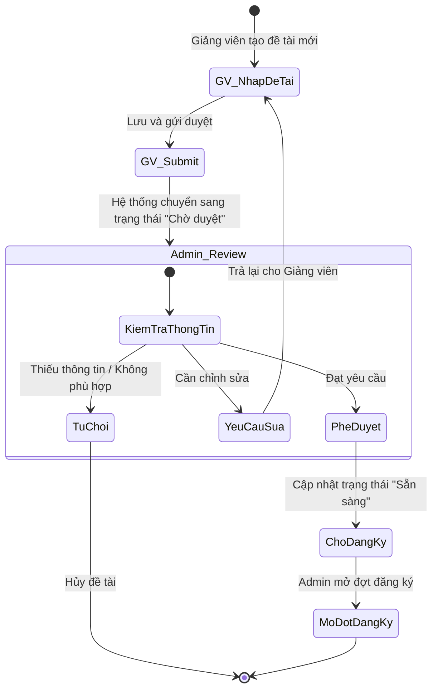
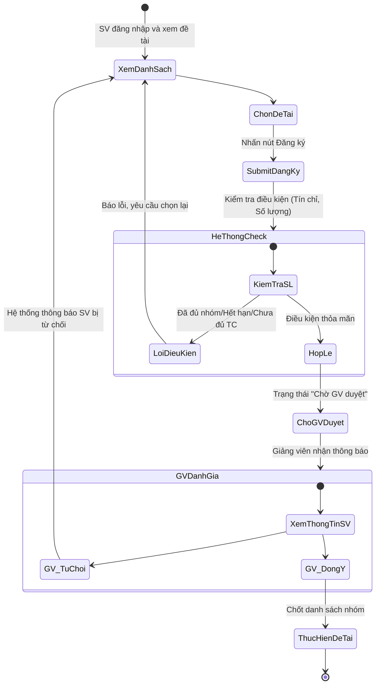
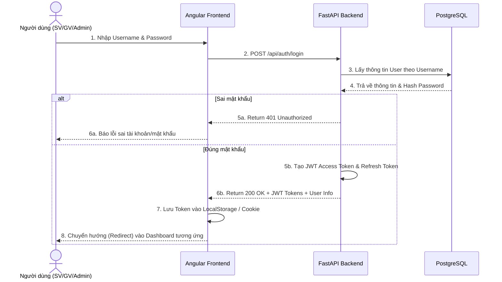
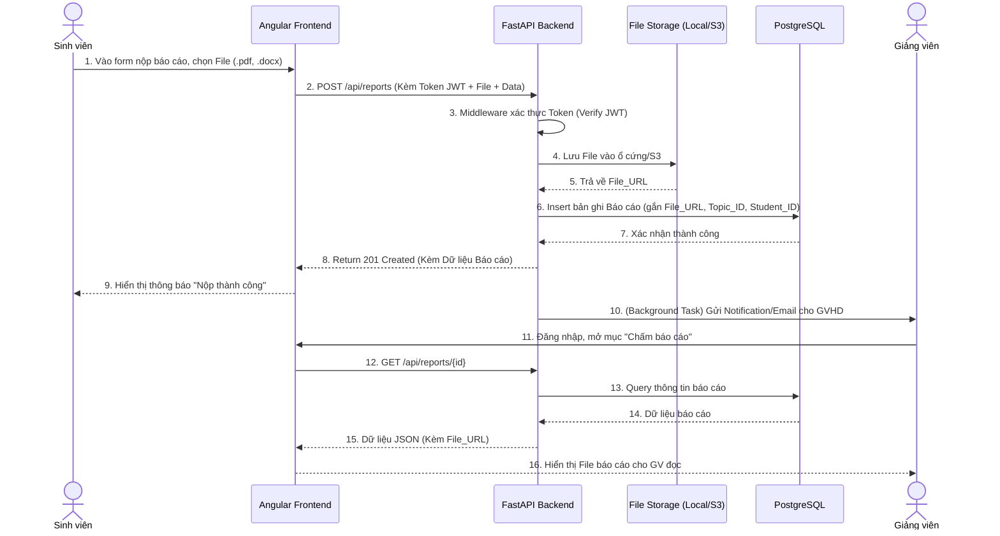
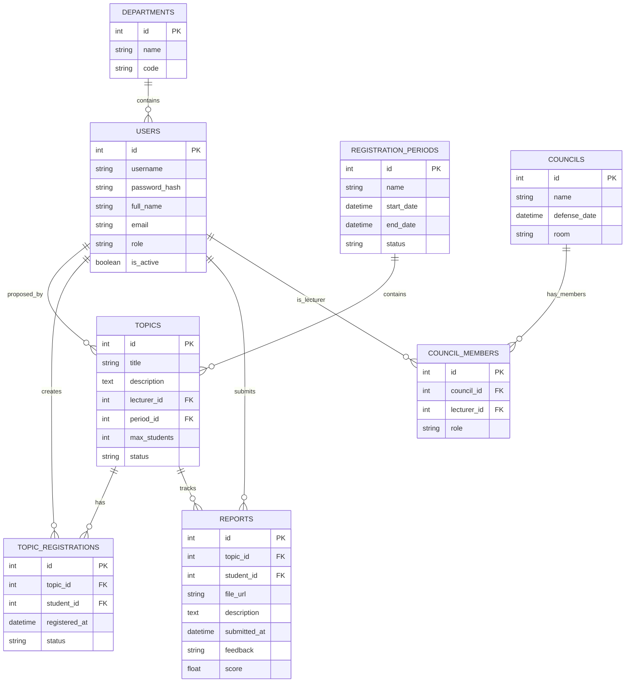

# DANH MỤC SƠ ĐỒ HỆ THỐNG: RESEARCH THESIS PORTAL
*(Tài liệu phục vụ Báo cáo Đồ án / Khóa luận)*

Dưới đây là tập hợp đầy đủ và chi tiết các sơ đồ (Mermaid) dành riêng cho hệ thống **Research Thesis Portal**. Các sơ đồ được thiết kế với độ chi tiết cao, giúp sinh viên, giảng viên và quản trị viên hiểu rõ quy trình hoạt động.

---

## 1. HỆ THỐNG SƠ ĐỒ USE CASE

### 1.1. Sơ đồ Use Case Tổng Quát

```mermaid
usecaseDiagram
    actor "Sinh viên" as SV
    actor "Giảng viên" as GV
    actor "Quản trị viên" as Admin

    package "Research Thesis Portal" {
        usecase "Phân hệ Đăng nhập & Xác thực" as Auth
        usecase "Phân hệ Quản lý Đề tài" as QLDeTai
        usecase "Phân hệ Đăng ký & Xét duyệt" as QLDangKy
        usecase "Phân hệ Quản lý Tiến độ & Báo cáo" as QLBaoCao
        usecase "Phân hệ Đánh giá & Nghiệm thu" as QLDanhGia
        usecase "Phân hệ Quản trị Hệ thống" as QLHeThong
    }

    SV --> Auth
    SV --> QLDangKy
    SV --> QLBaoCao
    SV --> QLDanhGia

    GV --> Auth
    GV --> QLDeTai
    GV --> QLDangKy
    GV --> QLBaoCao
    GV --> QLDanhGia

    Admin --> Auth
    Admin --> QLDeTai
    Admin --> QLDangKy
    Admin --> QLHeThong
    Admin --> QLDanhGia
```

### 1.2. Sơ đồ Use Case - Tác nhân Sinh viên

```mermaid
usecaseDiagram
    actor "Sinh viên" as SV

    package "Phân hệ Sinh viên" {
        usecase "Đăng nhập hệ thống" as UC1
        usecase "Xem danh sách đề tài mở" as UC2
        usecase "Xem chi tiết đề tài" as UC3
        usecase "Đăng ký tham gia đề tài" as UC4
        usecase "Hủy đăng ký đề tài" as UC5
        usecase "Nộp báo cáo định kỳ" as UC6
        usecase "Xem phản hồi/nhận xét từ GV" as UC7
        usecase "Xem lịch bảo vệ hội đồng" as UC8
        usecase "Xem kết quả điểm nghiệm thu" as UC9
    }

    SV --> UC1
    SV --> UC2
    SV --> UC3
    SV --> UC4
    SV --> UC5
    SV --> UC6
    SV --> UC7
    SV --> UC8
    SV --> UC9

    UC4 ..> UC1 : <<include>>
    UC6 ..> UC1 : <<include>>
```

### 1.3. Sơ đồ Use Case - Tác nhân Giảng viên

```mermaid
usecaseDiagram
    actor "Giảng viên" as GV

    package "Phân hệ Giảng viên" {
        usecase "Đề xuất đề tài mới" as UC1
        usecase "Cập nhật/Xóa đề tài đề xuất" as UC2
        usecase "Duyệt/Từ chối SV đăng ký" as UC3
        usecase "Xem danh sách nhóm SV hướng dẫn" as UC4
        usecase "Theo dõi tiến độ báo cáo" as UC5
        usecase "Nhận xét & Chấm điểm định kỳ" as UC6
        usecase "Tham gia hội đồng đánh giá" as UC7
        usecase "Chấm điểm nghiệm thu KLTN/NCKH" as UC8
    }

    GV --> UC1
    GV --> UC2
    GV --> UC3
    GV --> UC4
    GV --> UC5
    GV --> UC6
    GV --> UC7
    GV --> UC8
```

### 1.4. Sơ đồ Use Case - Tác nhân Quản trị viên (Admin)

```mermaid
usecaseDiagram
    actor "Quản trị viên" as Admin

    package "Phân hệ Quản trị" {
        usecase "Quản lý Tài khoản (CRUD)" as UC1
        usecase "Quản lý Danh mục (Khoa, Ngành)" as UC2
        usecase "Thiết lập Đợt đăng ký (Mở/Đóng)" as UC3
        usecase "Duyệt đề tài từ Giảng viên" as UC4
        usecase "Phân công Giảng viên hướng dẫn" as UC5
        usecase "Thành lập Hội đồng bảo vệ" as UC6
        usecase "Phân công Giảng viên vào Hội đồng" as UC7
        usecase "Lập lịch & Phòng bảo vệ" as UC8
        usecase "Công bố điểm/Kết quả tổng hợp" as UC9
    }

    Admin --> UC1
    Admin --> UC2
    Admin --> UC3
    Admin --> UC4
    Admin --> UC5
    Admin --> UC6
    Admin --> UC7
    Admin --> UC8
    Admin --> UC9
```

---

## 2. HỆ THỐNG SƠ ĐỒ HOẠT ĐỘNG (STATE DIAGRAM)

### 2.1. Quy trình Đề xuất và Xét duyệt Đề tài



### 2.2. Quy trình Sinh viên Đăng ký Đề tài



---

## 3. HỆ THỐNG SƠ ĐỒ TUẦN TỰ (SEQUENCE DIAGRAM)

### 3.1. Luồng Xác thực và Đăng nhập (JWT Auth)



### 3.2. Luồng Nộp Báo cáo Tiến độ (Của Sinh viên)



---

## 4. SƠ ĐỒ KIẾN TRÚC HỆ THỐNG (SYSTEM ARCHITECTURE)

Thiết kế dựa trên mô hình Single Page Application (SPA) kết nối với RESTful API, chạy độc lập các Container trên Docker.

```mermaid
graph TB
    subgraph Users [Người Dùng Cuối]
        U_SV(Sinh viên)
        U_GV(Giảng viên)
        U_AD(Quản trị viên)
    end

    subgraph Frontend [Angular Application - Docker Container 1]
        UI_SPA[Trình duyệt (Browser) - SPA]
        Guard[Auth Guards]
        Services[Angular HTTP Services]
        UI_SPA --> Guard
        Guard --> Services
    end

    subgraph Backend [FastAPI Application - Docker Container 2]
        Router[API Routers (Endpoints)]
        Auth[JWT Authentication & Middleware]
        Controllers[Business Logic / Services]
        ORM[SQLAlchemy ORM]

        Router --> Auth
        Auth --> Controllers
        Controllers --> ORM
    end

    subgraph Database [Database - Docker Container 3]
        PG[(PostgreSQL)]
    end

    Users -->|HTTPS / Trình duyệt| Frontend
    Services -->|HTTP/REST JSON| Router
    ORM -->|TCP (Port 5432)| PG

    classDef frontend fill:#ddf3ff,stroke:#0075b0,stroke-width:2px;
    classDef backend fill:#e1ffe5,stroke:#008b1a,stroke-width:2px;
    classDef db fill:#ffe1e1,stroke:#b00000,stroke-width:2px;

    class Frontend frontend;
    class Backend backend;
    class Database db;
```

---

## 5. SƠ ĐỒ THỰC THỂ LIÊN KẾT (ERD - ENTITY RELATIONSHIP)

Sơ đồ mô phỏng cấu trúc bảng cơ sở dữ liệu cốt lõi (Core Schema) bằng SQLAlchemy/PostgreSQL.



---

## 6. BẢNG TÓM TẮT CÁC ENDPOINT API

| Phương thức | Endpoint | Mô tả | Quyền hạn |
|---|---|---|---|
| POST | `/api/auth/login` | Đăng nhập | Public |
| POST | `/api/auth/refresh` | Làm mới JWT Token | User |
| GET | `/api/topics` | Lấy danh sách đề tài | Student, Lecturer |
| POST | `/api/topics` | Tạo đề tài mới | Lecturer |
| PUT | `/api/topics/{id}` | Cập nhật đề tài | Lecturer |
| DELETE | `/api/topics/{id}` | Xóa đề tài | Lecturer, Admin |
| POST | `/api/registrations` | Đăng ký đề tài | Student |
| GET | `/api/registrations/{id}` | Xem chi tiết đăng ký | Student, Lecturer |
| PUT | `/api/registrations/{id}/approve` | Duyệt đăng ký | Lecturer |
| PUT | `/api/registrations/{id}/reject` | Từ chối đăng ký | Lecturer |
| POST | `/api/reports` | Nộp báo cáo | Student |
| GET | `/api/reports/{id}` | Xem báo cáo | Student, Lecturer |
| PUT | `/api/reports/{id}/feedback` | Nhận xét báo cáo | Lecturer |
| GET | `/api/councils` | Xem danh sách hội đồng | Lecturer, Admin |
| POST | `/api/councils` | Tạo hội đồng | Admin |
| GET | `/api/users` | Xem danh sách người dùng | Admin |
| POST | `/api/users` | Tạo tài khoản | Admin |

---

## 7. LUỒNG LỰA VỤ CHỦ YẾU (MAIN WORKFLOWS)

### Luồng 1: Chu kỳ Một Đề tài Từ Đầu Đến Cuối

```
1. Giảng viên Đề xuất Đề tài
   ↓
2. Admin Duyệt Đề tài (APPROVED)
   ↓
3. Admin Mở Đợt Đăng ký
   ↓
4. Sinh viên Xem & Đăng ký Đề tài
   ↓
5. Giảng viên Duyệt Danh sách Sinh viên (Chốt nhóm)
   ↓
6. Sinh viên Nộp Báo cáo Định kỳ (Hàng tuần/Hàng tháng)
   ↓
7. Giảng viên Chấm & Phản hồi Báo cáo
   ↓
8. Admin Thành lập Hội đồng Bảo vệ
   ↓
9. Sinh viên Bảo vệ trước Hội đồng
   ↓
10. Công bố Điểm Cuối cùng (KLTN/NCKH)
```

---

Lưu ý: Tất cả các sơ đồ được thiết kế để hỗ trợ quá trình quản lý khóa luận/đồ án toàn diện, từ khâu đề xuất đề tài cho đến khi công bố kết quả cuối cùng.
