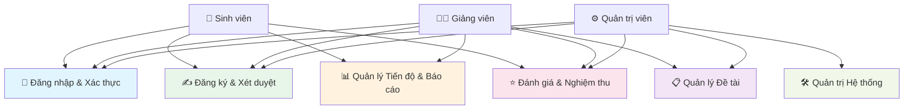
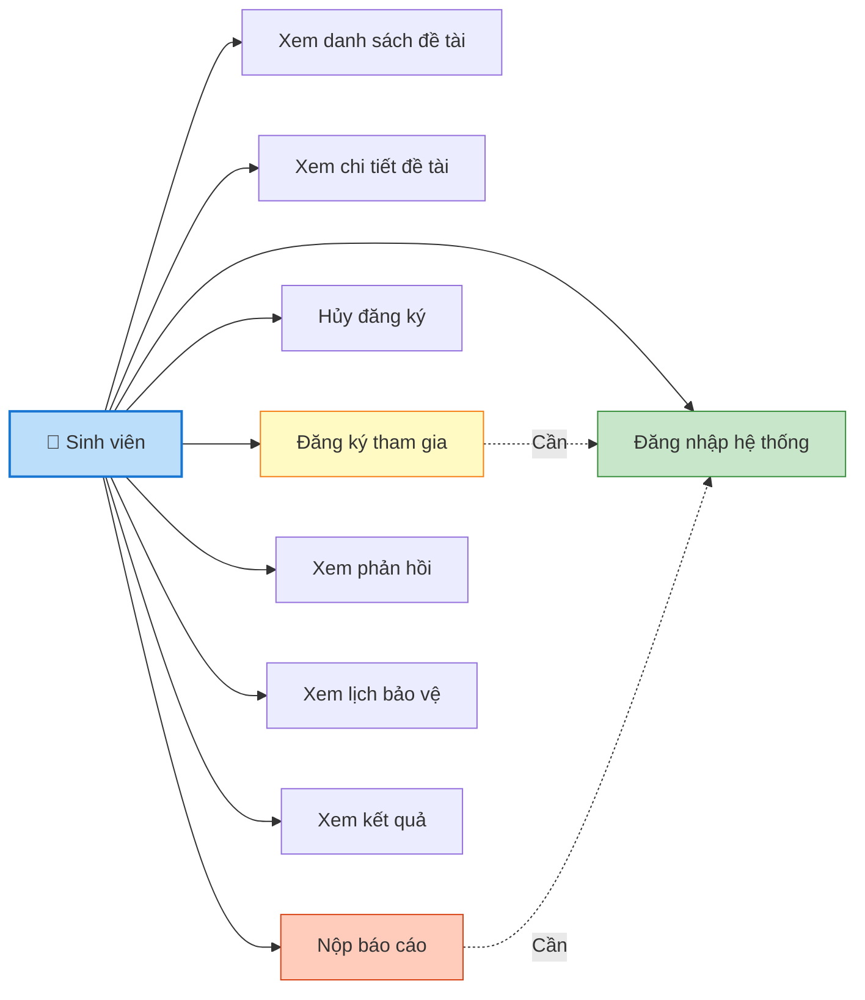
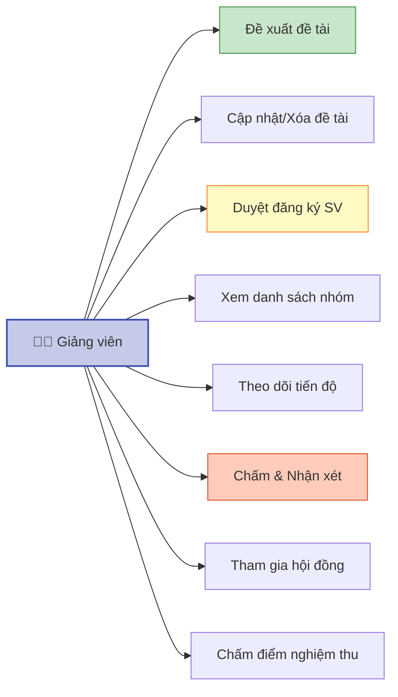
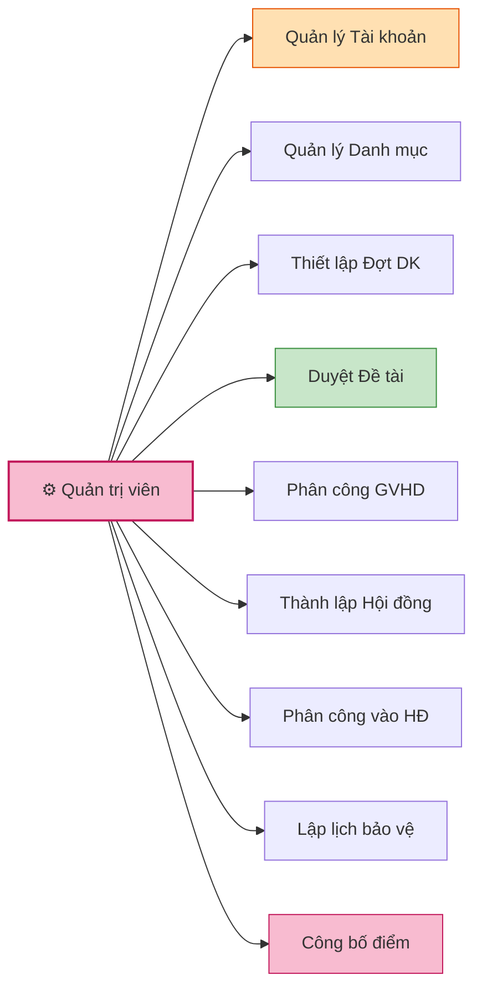
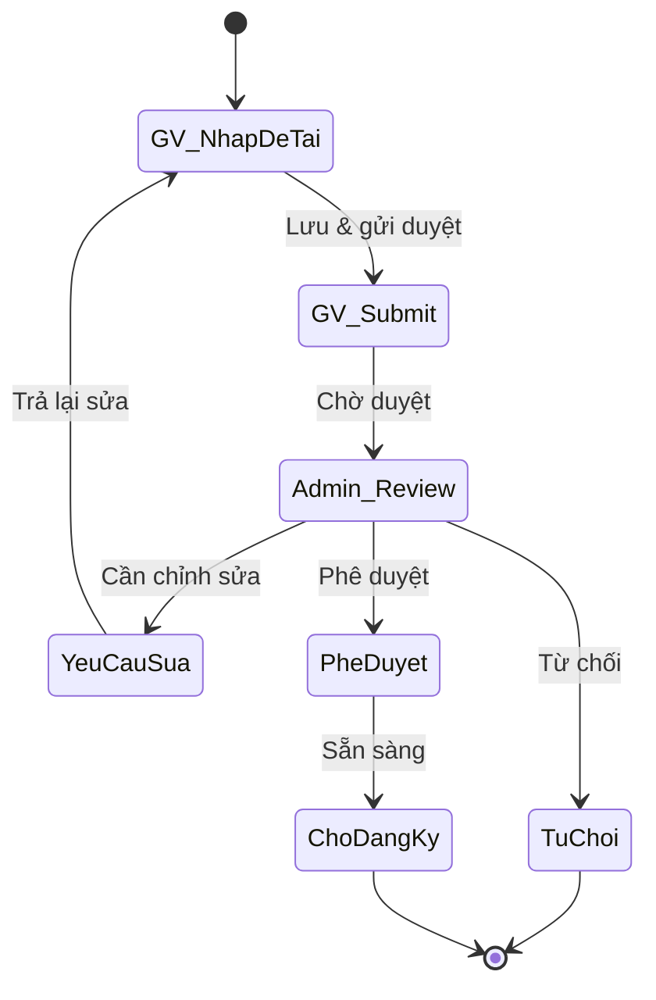
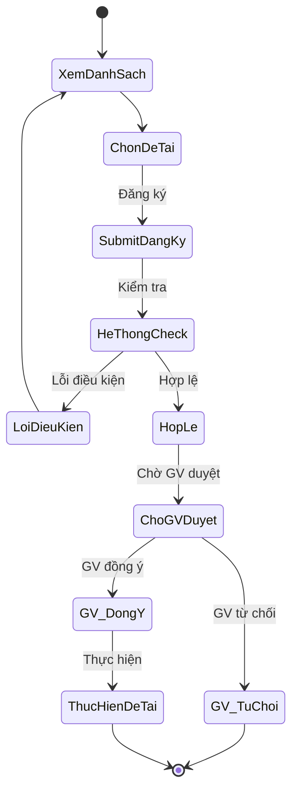
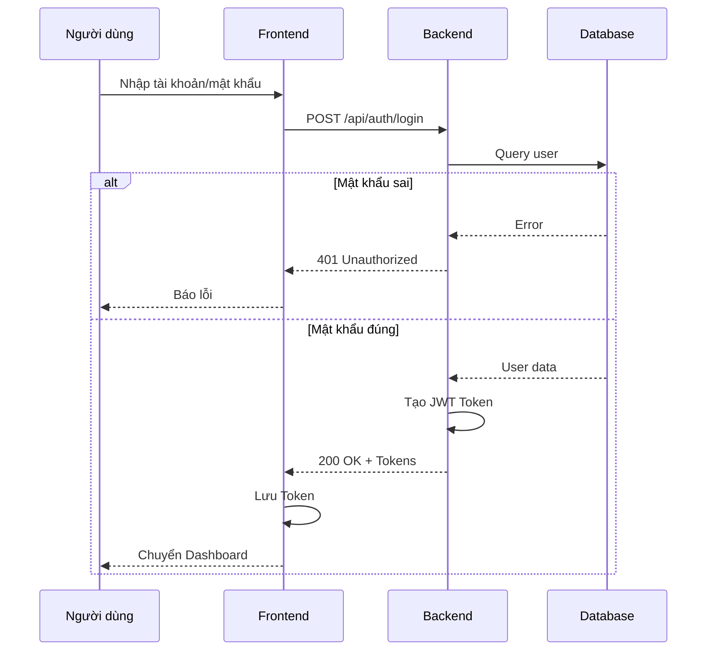
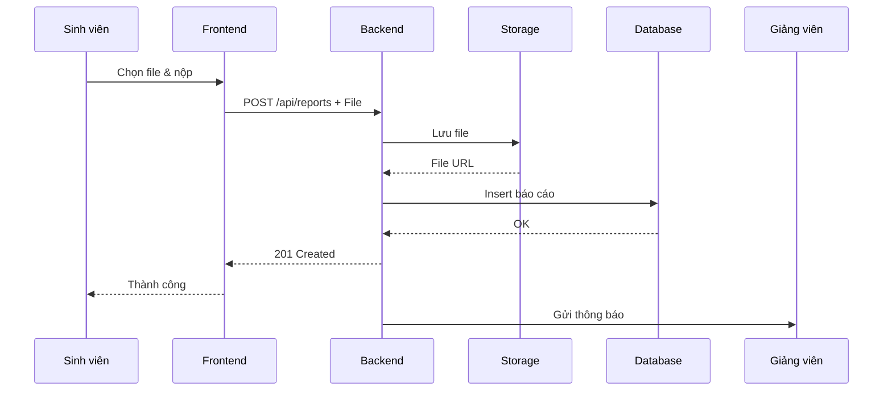
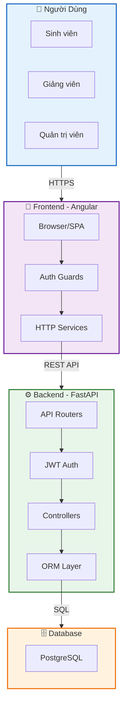
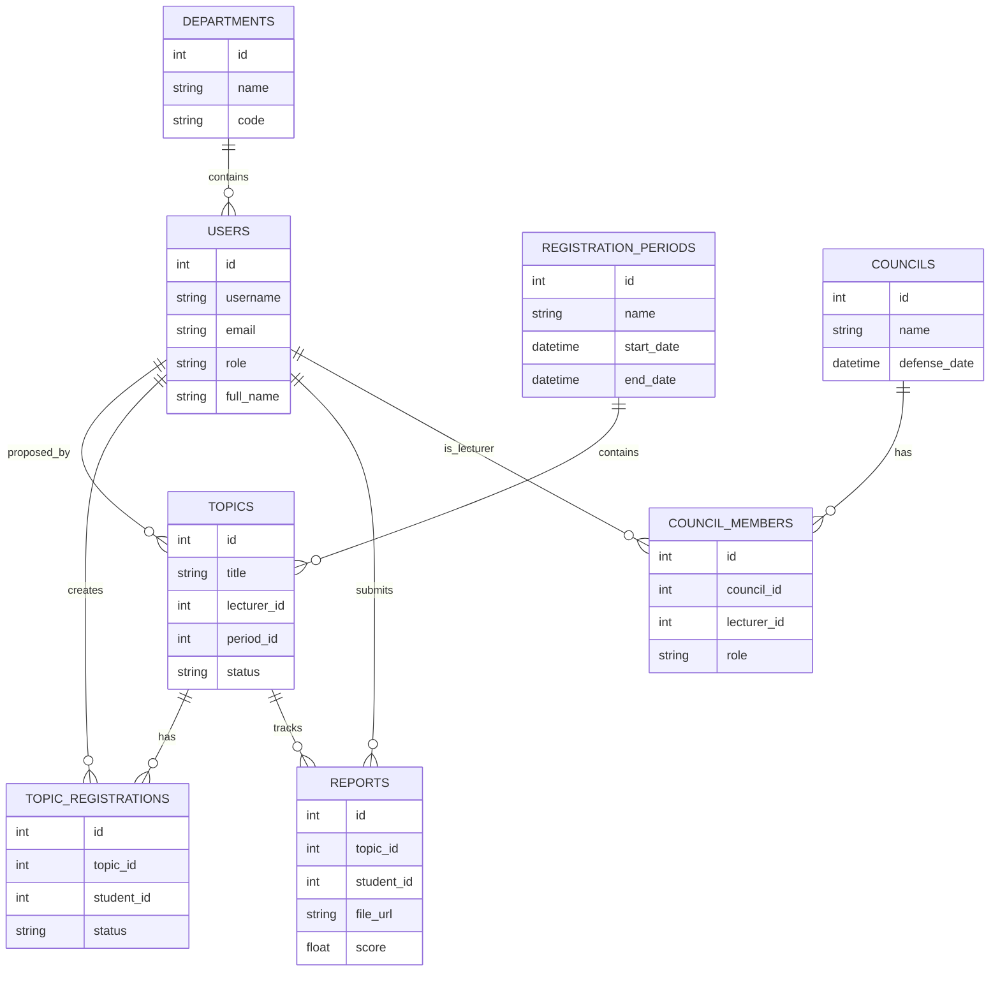

# DANH MỤC SƠ ĐỒ HỆ THỐNG: RESEARCH THESIS PORTAL
*(Tài liệu phục vụ Báo cáo Đồ án / Khóa luận)*

Dưới đây là tập hợp đầy đủ và chi tiết các sơ đồ (Mermaid) dành riêng cho hệ thống **Research Thesis Portal**. Các sơ đồ được thiết kế với độ chi tiết cao để phục vụ báo cáo đồ án / khóa luận.

---

## 1. HỆ THỐNG SƠ ĐỒ USE CASE

### 1.1. Sơ đồ Use Case Tổng Quát



### 1.2. Sơ đồ Use Case - Tác nhân Sinh viên



### 1.3. Sơ đồ Use Case - Tác nhân Giảng viên



### 1.4. Sơ đồ Use Case - Tác nhân Quản trị viên



---

## 2. HỆ THỐNG SƠ ĐỒ HOẠT ĐỘNG (STATE DIAGRAM)

### 2.1. Quy trình Đề xuất và Xét duyệt Đề tài



### 2.2. Quy trình Sinh viên Đăng ký Đề tài



---

## 3. HỆ THỐNG SƠ ĐỒ TUẦN TỰ (SEQUENCE DIAGRAM)

### 3.1. Luồng Xác thực và Đăng nhập (JWT Auth)



### 3.2. Luồng Nộp Báo cáo Tiến độ



---

## 4. SƠ ĐỒ KIẾN TRÚC HỆ THỐNG



---

## 5. SƠ ĐỒ THỰC THỂ LIÊN KẾT (ERD - ENTITY RELATIONSHIP)



---

## 6. BẢNG TÓM TẮT CÁC ENDPOINT API

| Phương thức | Endpoint | Mô tả | Quyền hạn |
|---|---|---|---|
| POST | `/api/auth/login` | Đăng nhập | Public |
| POST | `/api/auth/refresh` | Làm mới Token | User |
| GET | `/api/topics` | Danh sách đề tài | Student, Lecturer |
| POST | `/api/topics` | Tạo đề tài | Lecturer |
| PUT | `/api/topics/{id}` | Cập nhật đề tài | Lecturer |
| DELETE | `/api/topics/{id}` | Xóa đề tài | Lecturer, Admin |
| POST | `/api/registrations` | Đăng ký đề tài | Student |
| PUT | `/api/registrations/{id}/approve` | Duyệt đăng ký | Lecturer |
| PUT | `/api/registrations/{id}/reject` | Từ chối đăng ký | Lecturer |
| POST | `/api/reports` | Nộp báo cáo | Student |
| GET | `/api/reports/{id}` | Xem báo cáo | Student, Lecturer |
| PUT | `/api/reports/{id}/feedback` | Nhận xét báo cáo | Lecturer |
| GET | `/api/councils` | Danh sách hội đồng | Lecturer, Admin |
| POST | `/api/councils` | Tạo hội đồng | Admin |

---

## 7. LUỒNG LỰA VỤ CHỦ YẾU

### Luồng 1: Chu kỳ Một Đề tài Từ Đầu Đến Cuối

```
1. Giảng viên Đề xuất Đề tài
   ↓
2. Admin Duyệt Đề tài (APPROVED)
   ↓
3. Admin Mở Đợt Đăng ký
   ↓
4. Sinh viên Xem & Đăng ký Đề tài
   ↓
5. Giảng viên Duyệt Danh sách Sinh viên (Chốt nhóm)
   ↓
6. Sinh viên Nộp Báo cáo Định kỳ
   ↓
7. Giảng viên Chấm & Phản hồi
   ↓
8. Admin Thành lập Hội đồng
   ↓
9. Sinh viên Bảo vệ trước Hội đồng
   ↓
10. Công bố Điểm Cuối cùng
```

---

**Lưu ý:** Tất cả các sơ đồ đã được tối ưu hóa để hiển thị đúng trong bảng xem trước GitHub.
